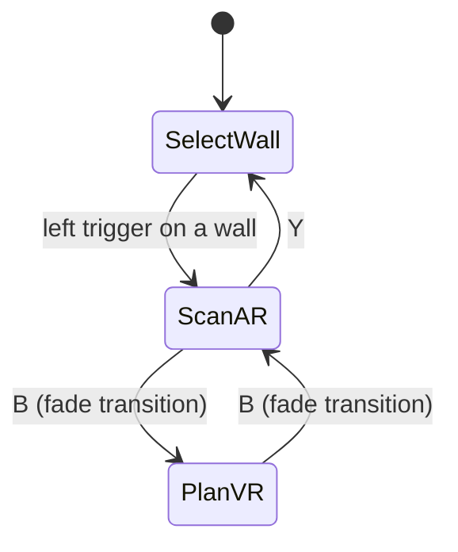

# Cross-Reality Drilling Assistant

A Meta Quest 3 demonstrator that turns the classic "where can I safely drill into this wall?" problem into a cross-reality workflow: scan a real wall for hidden structures in AR, then switch into VR to plan drill holes and cable routes on a grabbable digital copy of that same wall, and finally project the plan back onto the physical wall as an AR overlay.

Built with Unity 6000.4.2f1, the Meta XR Core SDK and the Mixed Reality Utility Kit (MRUK).

> [!NOTE]
> This project is the final assignment of the *Virtual Reality and 3D Interaction* lecture (Human-Computer Interaction group, Trier University, summer term 2026).

## The assignment

The exercise ("Cross Reality") asked for three things:

1. **Identify an existing, work-focused workflow** that involves a digital or analog device (explicitly not a game).
2. **Choose a cross-reality system type** for extending it: transitional, substitutional, or multi-user, and justify which parts of the workflow benefit from cross-reality and which do not.
3. **Implement a demonstrator** in which every identified core component works at least on a basic level, running both in the Unity editor and as a Quest 3 APK.

## The concept

**Workflow:** renovation and electrical work. Before drilling into a wall, a worker sweeps it with a stud/live-wire detector to find studs, pipes and cables, then marks drill positions and planned cable routes, usually with a pencil on the wall and a paper plan. The device in the loop is the handheld wall detector.

**Cross-reality type: transitional.** The physical part of the workflow (sweeping the real wall with a real detector in hand) is kept in AR passthrough, because the detector only makes sense at the real wall. The planning part is moved to VR, because planning benefits from stepping away from reality: in VR the wall becomes a virtual object you can grab, rotate and scale to inspect findings and lay out a plan without physical constraints. A fade-to-black cut transitions between the two sides, and the plan travels with you in both directions.

Five core components make up the demonstrator:

| # | Component | In the app |
|---|-----------|-----------|
| 1 | Detecting hidden structures with the device | The left controller acts as the stud finder. Sweeping it near the real wall reveals hidden cables and studs with a haptic pulse. |
| 2 | A shared digital model of the wall | An editable, wall-local data model ([ScannedWallModel.cs](Assets/Scripts/Core/ScannedWallModel.cs)) is the single source of truth for both realities. |
| 3 | Planning on the wall | In VR the wall appears as a manipulable copy: place drill markers, chain planned routes across multiple points, erase, move, rotate and scale. |
| 4 | Bringing the plan back to reality | The AR overlay re-projects all findings and planned markers onto the physical wall at their true positions, regardless of how the VR copy was moved or scaled. |
| 5 | Persistence | Plans autosave per wall (keyed by the wall anchor's UUID) and are restored when the same wall is selected in a later session. |

## How it works

The app is a single scene driven by one state machine:



- **SelectWall** (passthrough): point the left controller ray at any wall of your scanned room and confirm with the left trigger. A previously saved plan for that wall is restored; otherwise the wall is seeded with 3 to 5 hidden structures (cable runs that bend like real installations, and studs).
- **ScanAR** (passthrough): sweep the left controller across the real wall. Structures reveal themselves when the controller gets close, with haptic feedback as "detector beep".
- **PlanVR** (fully virtual): the scanned wall floats in front of you as a copy. Revealed structures are solid, unrevealed ones show as ghosts.

### Controls

| Input | SelectWall | ScanAR | PlanVR |
|-------|-----------|--------|--------|
| Left controller | Aim ray at wall | Sweep as stud finder | Grip: grab wall copy |
| Left trigger | Confirm wall | | Drop a route node (chain a route point by point) |
| Right trigger | | | Place drill marker / delete marker under ray |
| Both grips | | | Scale the wall copy |
| A | | | Erase marker or route leg under ray |
| B | | Switch to VR | Switch back to AR |
| X | | | End the current route |
| Y | | Back to wall selection | |

## Implementation notes

A few decisions worth calling out:

- **Wall-local coordinates everywhere.** All structures, markers and routes are stored in the wall anchor's coordinate frame. The VR editor only ever transforms the root of the display copy, never the data, so re-projecting onto the real wall is a pure instantiation at identity and stays truthful no matter what happened in VR.
- **Robust room loading on device.** MRUK's auto-load can fire before the Android scene permission is granted and then never retry. [MrukBootstrap.cs](Assets/Scripts/MrukBootstrap.cs) waits for the permission, retries explicitly, and as a last resort loads a room snapshot captured over Quest Link ([RoomSnapshotSaver.cs](Assets/Scripts/Editor/RoomSnapshotSaver.cs)). MRUK's own JSON serialization preserves anchor UUIDs, so saved plans still match after the fallback.
- **Reproducible scene wiring.** `Tools > Drilling Assistant > Setup Scene` ([SceneSetup.cs](Assets/Scripts/Editor/SceneSetup.cs)) builds and wires the whole scene idempotently instead of relying on manual inspector setup.
- **Autosave, no save button.** Every model change triggers a save of the current wall's entry in a single JSON file; switching walls keeps every wall's plan.

## Getting started

### Just want to try it?

A prebuilt Quest 3 APK is attached to the [latest release](../../releases/latest). Sideload it with developer mode enabled:

```sh
adb install DrillingAssistant.apk
```

(or use [SideQuest](https://sidequestvr.com/) if you prefer a GUI). The headset needs a completed Space Setup so the app can find your walls.

### Requirements

- Unity **6000.4.2f1**
- A Meta Quest 3 with a completed Space Setup (room scan)
- For editor play mode: Quest Link (the app uses live device scene data over Link)

### Run in the editor

1. Open the project and load `Assets/Scenes/SampleScene.unity`.
2. Connect the Quest via Link and enter play mode.
3. Optional: while playing over Link, run `Tools > Drilling Assistant > Save Room Snapshot` to refresh the on-device fallback room, then re-run `Setup Scene`.

### Build for Quest

Standard Android/Quest build (IL2CPP). The APK falls back to the bundled room snapshot if the OS never delivers live scene data, a known Quest quirk this project works around.

## License

[MIT](LICENSE), covering the application code in `Assets/Scripts`, the tests
in `Assets/Tests` and the project configuration in this repository.

The Meta XR Core SDK and the Mixed Reality Utility Kit are not vendored here.
They are pulled as Unity packages via `Packages/manifest.json` and remain under
Meta's own license terms.

## Project layout

```
Assets/
  Scenes/SampleScene.unity   Single scene, wired by the SceneSetup editor tool
  Scripts/                   All application code (namespace DrillingAssistant)
    AppStateManager.cs       State machine: SelectWall -> ScanAR <-> PlanVR
    WallSelector.cs          Wall picking via controller ray (MRUK anchors)
    StructureRevealer.cs     Stud-finder logic + haptics (AR)
    VRWallEditor.cs          Grabbable wall copy + marker/route editing (VR)
    OverlayProjector.cs      Re-projection onto the real wall (AR)
    WallPlanStore.cs         Per-wall autosave/restore (JSON, keyed by anchor UUID)
    TransitionController.cs  Cut + fade transition between AR and VR
    WallModelVisualizer.cs   Shared visual builder for overlay and VR copy
    Core/                    Device-free assembly (DrillingAssistant.Core)
      ScannedWallModel.cs    Wall-local data model, single source of truth
      PlanGeometry.cs        Plan maths: route legs and probe distances
      StructureCatalog.cs    Type -> color/size mapping
    Editor/                  SceneSetup and RoomSnapshotSaver tools
  Tests/EditMode/            Edit-mode tests over Core, no headset needed
```
